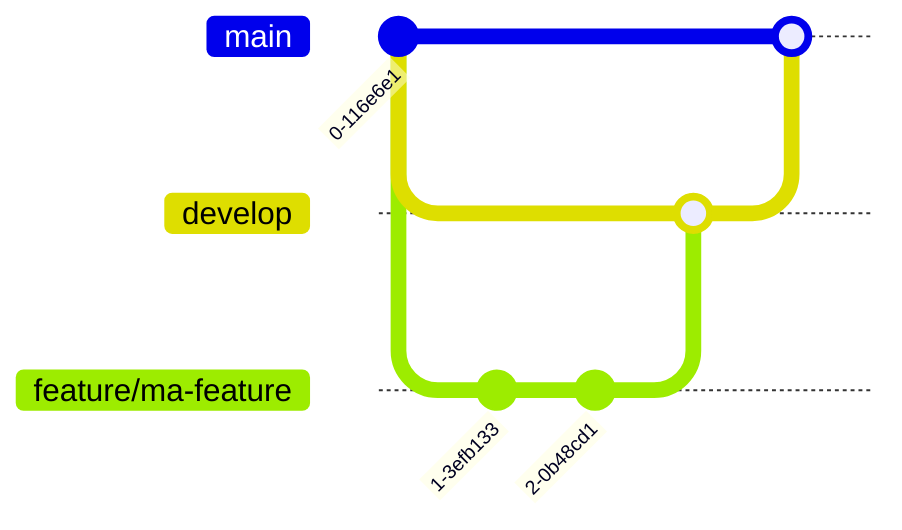

# Procédure de livraison

## Branches

| Branche | Protection | Rôle |
|---------|------------|------|
| `main` | Protégée | Production — PRs uniquement depuis `develop` ou `hotfix/*` |
| `develop` | Protégée | Intégration — PRs depuis n'importe quelle branche de travail |
| `feature/*` | Aucune | Branche de travail dédiée à une fonctionnalité |
| `fix/*` | Aucune | Branche de travail dédiée à une correction |
| `hotfix/*` | Aucune | Correction urgente ciblant directement `main` |

## Workflow

### 1. Branche de travail → `develop`



1. Créer une branche depuis `develop` : `git checkout develop && git checkout -b feature/ma-feature`
2. Coder, committer, pusher
3. Ouvrir une **Pull Request** vers `develop`
4. Le titre de la PR décrit le changement (pas de format imposé, mais clair)
5. La description détaille le contenu
6. Les pipelines CI doivent passer (build + tests)
7. **Merge en squash** — les commits intermédiaires sont squashés en un seul

### 2. `develop` → `main` (release)

1. S'assurer que `develop` est stable (CI ok, revue faite)
2. Ouvrir une **Pull Request** de `develop` vers `main`
3. Le titre de la PR **doit** suivre le format :
   ```
   Release X.X.X - Intitulé de la release
   ```
   Exemples : `Release 1.2.0 - Ajout collecteur LinkedIn`, `Release 1.2.1 - Fix crash scraping`
4. La description résume le contenu de la release (features, fixes, changements)
5. Les pipelines CI doivent passer
6. **Merge en squash** — un seul commit de merge dans `main`
7. **Automatiquement** : une GitHub Action détecte le numéro de version dans le titre de la PR mergée et créé un tag `vX.X.X` avec le message *Release X.X.X*

### 3. Hotfix (urgence)

1. Créer une branche `hotfix/*` depuis `main`
2. Corriger, committer, pusher
3. Ouvrir une PR vers `main` (autorisée par `check-source-branch`)
4. Après merge, synchroniser `develop` : `git checkout develop && git merge main`

## Règles de merge

- **Squash merge uniquement** sur toutes les branches protégées
- Les branches de travail sont **supprimées après merge**

## Pipelines CI

Les workflows GitHub Actions suivants s'exécutent sur chaque PR et push vers `main`/`develop` :

| Workflow | Déclencheur | Rôle |
|----------|-------------|------|
| `CI` | PR/push vers `main`/`develop` | `cargo build` + `cargo test` |
| `check-source-branch` | PR vers `main` | Vérifie que la source est `develop` ou `hotfix/*` |
| `auto-tag` | Merge d'une PR vers `main` | Crée un tag Git si le titre commence par "Release" |

Les pipelines CI sont des **status checks obligatoires** avant merge.

## Convention de nommage

- `feature/<description>` — nouvelle fonctionnalité
- `fix/<description>` — correction de bug
- `hotfix/<description>` — correction urgente (vers main direct)
- `chore/<description>` — tâche technique (CI, doc, refactor)
- `release/<version>` — préparation de release (optionnel, PR directe develop→main)
